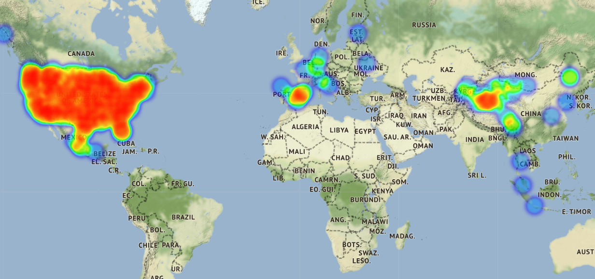
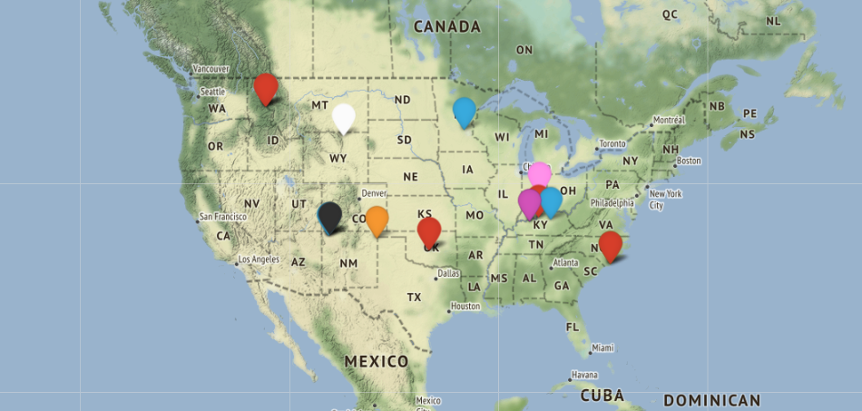
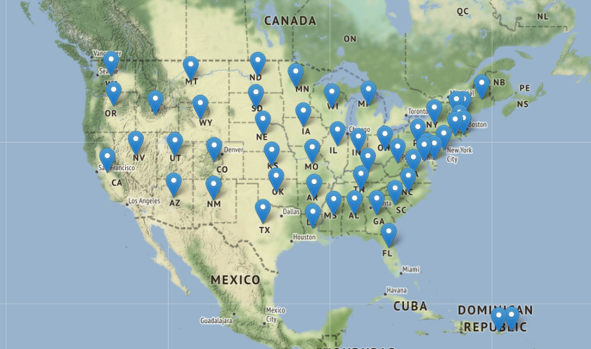
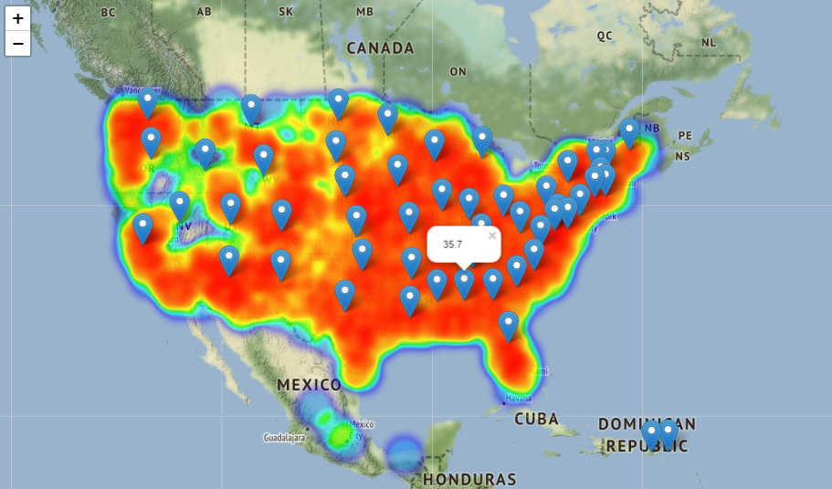

# Fast Obesity

O trabalho tem como objetivo aplicar os conceitos de Data Science. Para isso os datasets foram escolhidos visando demonstrar um dos grandes problemas de saúde do seculo XXI segundo a Organização Mundial da Saúde (OMS), que considera a obesidade como uma epidemia crescente, tendo como o estilo de vida moderno um dos grandes causadores desse problema. Com aumento crescente de redes de fast-food, alimentos processados, industrializados e a facilidade para se obter esses produtos. O trabalho consiste em demostrar relações entre as redes de fast-food e a obesidade presentes no E.U.A.

## Apresentação

## DataSets
 * [Obesity](https://data.world/us-hhs-gov/8e0ede43-eaa4-4a93-9f30-fb36b8245685)
 * [Fast Food Restaurants Across America](https://www.kaggle.com/datafiniti/fast-food-restaurants)

## Membros
<ul align=center>
  <a href="https://github.com/andreLumor"></a>
 <a href="https://github.com/EulleSA"></a>
 <a href="https://github.com/nandomaciel"></a>
 <a href="https://github.com/LuisandradeA"></a>
</ul>

# Abordagem
* Limpando os Datasets
* Cruzando os Datasets
* Plotando informações

## Divisão
* André: Limpeza do dataset referente a obesidade, união dos datasets
* Eulle: Limpeza do dataset referente a Fast food, união dos datasets
* Fernando: plotagem dos mapas fast food 
* Luis: plotagem dos mapas obesidade
```
Todos os integrantes participaram igualmente na escolha dos dataset, na forma de representação dos mapas e no que deveria constar no dataset.
```
## Dificuldade
Devido ao tamanho dos datasets, foi necessário limitar a quantidade de informações utilizadas para gerar pontos referentes às redes de Fast foods e a quantidade de obesidade por estados. Porém mantendo a proporção dos dados.

## Problemas encontrados
* Algumas informações dos datasets mostram pontos fora do mapa dos E.U.A


## resultados




## Futuro...
* Visualização de mapa de acordo com a cor da população e classe financeira 
* Plot de mapa demonstrando zonas de obesidade ligadas a academias de musculação
* Obesidade ligado a regiões com índices de ataque cardíaco e diabetes
* Obesidade ligada  a regiões com índices violência

## Refêrencia
* https://pt.stackoverflow.com/
* https://www.cdc.gov/obesity/data/adult.html
* https://stateofobesity.org/adult-obesity/

# Recomendações
* https://www.ncbi.nlm.nih.gov/pmc/articles/PMC4830390/
* https://www.ncbi.nlm.nih.gov/pmc/articles/PMC3236990/
* https://minorityhealth.hhs.gov/omh/browse.aspx?lvl=4&lvlid=25
* https://www.vox.com/cards/obesity-weight-loss-diet/obesity-in-minorities
* [Super Size me](https://www.imdb.com/title/tt0390521/)


